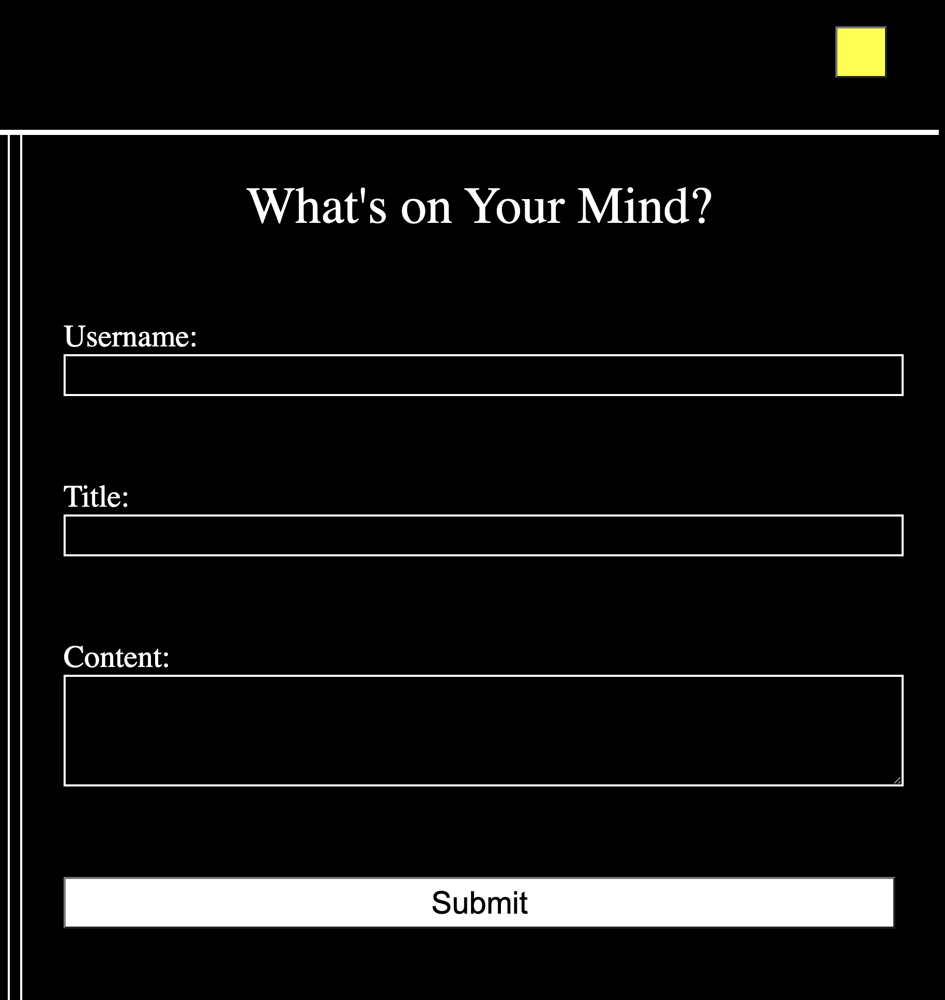
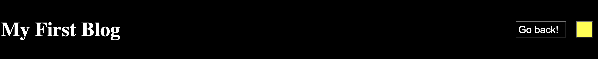
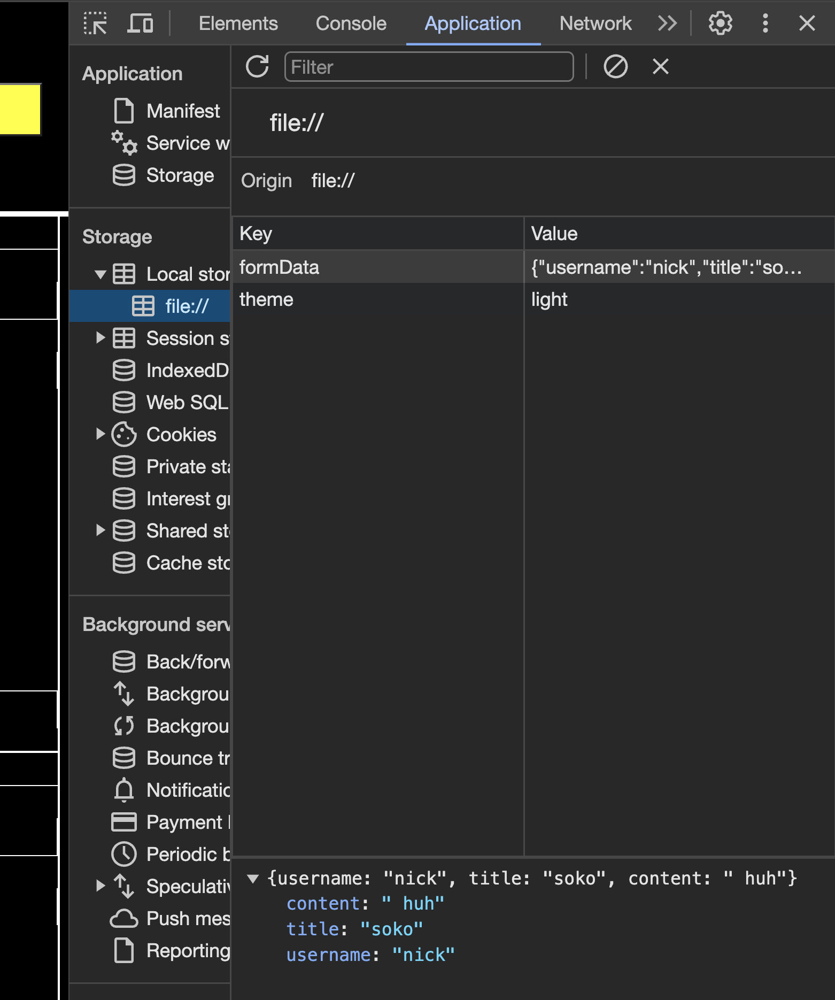

# my-blog-hw4
A form submission app that stores blog posts and can toggle and light and dark mode. 

## Installation

No installation needed just visit the following link to the deployed web page!

<!-- TODO add link to deployed gitpage -->

## Usage

To use the applicaton. Fill out the form on the first page. After clicking submit your content, author name, and title of your post will be posted on a new page!

On the blog posts page (page#2) you can use the BACK button to go back and submit more blog posts and on both pages you can use the light/dark theme button to switch between light and dark mode.

You can also view important information being stored in your local Storage if you right click ---> inspect and read the console and application tabs. Light/Dark theme aswell as form submissions will be stored in there. 

## No Configuration

## Documentation / Credits

For information I used for developing a light/dark theme visit the following link to a youtube video. Credit: GreatStack

https://www.youtube.com/watch?v=9LZGB3OLXNQ

Instructor Josh

AI learning assistant!

## What i've learned and obstacles overcome

1. I've learned some information on how localStorage works and how you can store information there and have Javascript deploy interactive events based on whats in there.

2. I learned how to make a basic light/dark mode toggle switch. 

3. I learned how to take info. from local storage and append it into a document. 

4. I learned how to make a first pages inputs be displayed on a 2nd page.

## Obstacles

1. Learning how to get localStorage to actually pick up certain keys and use them to display info on screen.

2. Having light/dark mode remain persistant after page refresh or back button.

3. The hardest part was definitely getting the blog posts to remain on the 2nd page and not reset after you filled out another form. 

## Updates

No future updates on this project. 

## No Contributions

